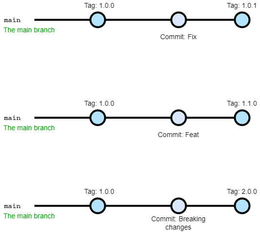

# CWI Talk - Semantic Release
Apresentação da Talk sobre o Semantic Release na CWI

## O que é?

É uma lib para automatizar o fluxo de geração de versão do projeto. É possível incrementar a versão, gerar um changelog, publicar o pacote, entre outras funcionalidades disponíveis por plugins.

[https://github.com/semantic-release/semantic-release](https://github.com/semantic-release/semantic-release)

## Changelog

É uma lista das alterações feitas em um projeto, ordenada cronologicamente.


## Como funciona?

- Utiliza o padrão de versão [SemVer](https://semver.org/)
    - Major: Quando alguma alteração é incompatível com as versões anteriores.
    - Minor: Quando é adicionada alguma nova funcionalidade que é compatível com a versão.
    - Patch: Quando é feita alguma correção da versão.
- Calcula a versão analisando cada commit feito desde a última versão gerada
- Por padrão utiliza a [convenção de commit message do Angular](https://github.com/angular/angular/blob/main/CONTRIBUTING.md#-commit-message-format)

```tsx
<type>(<scope>): <short summary>
  │       │             │
  │       │             └─⫸ Summary in present tense. Not capitalized. No period at the end.
  │       │
  │       └─⫸ Commit Scope: animations|bazel|benchpress|common|compiler|compiler-cli|core|
  │                          elements|forms|http|language-service|localize|platform-browser|
  │                          platform-browser-dynamic|platform-server|router|service-worker|
  │                          upgrade|zone.js|packaging|changelog|docs-infra|migrations|ngcc|ve|
  │                          devtools
  │
  └─⫸ Commit Type: build|ci|docs|feat|fix|perf|refactor|test
```

- Extensível por plugins [oficiais](https://github.com/semantic-release/semantic-release/blob/master/docs/extending/plugins-list.md#official-plugins) e da [comunidade](https://github.com/semantic-release/semantic-release/blob/master/docs/extending/plugins-list.md#community-plugins)



Figura 1

## Gitmoji

É um guia para padronizar commit message.

[gitmoji](https://gitmoji.dev/)
